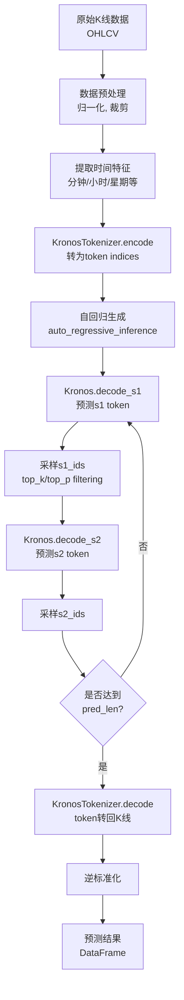

# Kronos 项目架构分析

## 📌 项目简介

**Kronos** 是首个开源的金融市场 K 线（蜡烛图）基础模型，由 NeoQuasar 团队开发，已被 AAAI 2026 接收。该项目专门针对金融市场数据的"语言"进行预训练，训练数据来自全球超过 45 个交易所。

### 核心特点
- **decoder-only 架构**：采用自回归 Transformer 架构
- **两阶段框架**：Tokenizer（量化阶段）+ Predictor（预测阶段）
- **多模型支持**：提供 mini、small、base、large 四种规模的模型
- **开箱即用**：通过 Hugging Face Hub 快速加载模型
- **高度灵活**：支持微调、批量预测、Web UI 等多种使用方式

---

## 🏗️ 核心架构组件

### 1. **KronosTokenizer（量化编码器）**

#### 作用
将连续的多维 K 线数据（OHLCV）量化为分层离散 token，这是 Kronos 的第一阶段。

#### 技术细节
```
路径: model/kronos.py (KronosTokenizer 类)
```

**关键组件：**
- **编码器（Encoder）**：`n_enc_layers` 层 Transformer Block，用于提取 K 线特征
- **量化器（BSQuantizer）**：Binary Spherical Quantizer，将连续特征量化为二进制球面码本
  - 使用分层量化：`s1_bits`（pre token）+ `s2_bits`（post token）
  - 位于 `model/module.py` 中的 `BinarySphericalQuantizer` 类
- **解码器（Decoder）**：`n_dec_layers` 层 Transformer Block，用于重建原始数据

**工作流程：**
1. 输入 K 线数据 → Embedding → Encoder Layers
2. 通过 `quant_embed` 线性层映射到 codebook 维度
3. BSQuantizer 量化为离散 token（返回 indices）
4. Decoder Layers 重建数据（用于训练时的重建损失）

**关键方法：**
- `encode(x)`: 将 K 线数据编码为 token indices
- `decode(indices)`: 将 token indices 解码回 K 线数据
- `forward(x)`: 完整的编码-量化-解码流程（训练使用）

---

### 2. **Kronos（预测模型）**

#### 作用
基于量化后的 token 进行自回归预测，这是 Kronos 的第二阶段。

#### 技术细节
```
路径: model/kronos.py (Kronos 类)
```

**关键组件：**
- **分层嵌入（HierarchicalEmbedding）**：将 s1 和 s2 token 嵌入到同一空间
- **时间嵌入（TemporalEmbedding）**：编码时间特征（分钟、小时、星期等）
- **Transformer 主干**：`n_layers` 层 Transformer Block
- **依赖感知层（DependencyAwareLayer）**：让 s2 token 的预测依赖于 s1 token
- **双头输出（DualHead）**：分别预测 s1 和 s2 token

**工作流程：**
1. 输入 s1_ids 和 s2_ids → HierarchicalEmbedding
2. 添加时间嵌入（可选）
3. 通过 Transformer Layers 提取上下文特征
4. 预测 s1_logits
5. 基于 s1 预测（或真实值）通过 DependencyAwareLayer 预测 s2_logits

**关键方法：**
- `forward()`: 完整的前向传播（训练使用）
- `decode_s1()`: 仅解码 s1 token
- `decode_s2()`: 基于上下文和 s1 解码 s2 token

---

### 3. **KronosPredictor（预测接口）**

#### 作用
提供高层 API，封装数据预处理、推理和后处理的完整流程。

#### 技术细节
```
路径: model/kronos.py (KronosPredictor 类)
```

**核心功能：**
- **数据标准化**：自动计算 mean/std 并进行归一化、裁剪
- **时间特征提取**：从时间戳提取分钟、小时、星期、日、月等特征
- **自回归推理**：调用 `auto_regressive_inference()` 逐步生成未来预测
- **逆标准化**：将预测结果还原到原始数据尺度
- **批量预测**：`predict_batch()` 支持并行处理多个时间序列

**关键方法：**
- `predict()`: 单个时间序列预测
- `predict_batch()`: 批量并行预测
- `generate()`: 底层推理调用

**自动设备检测：**
- 优先使用 CUDA（NVIDIA GPU）
- 其次使用 MPS（Apple Silicon GPU）
- 回退到 CPU

---

### 4. **BSQuantizer（二进制球面量化器）**

#### 作用
核心量化模块，将连续向量量化为二进制码本。

#### 技术细节
```
路径: model/module.py (BinarySphericalQuantizer 类)
```

**量化原理：**
- **球面量化**：将向量投影到单位超球面上
- **二进制编码**：使用 {-1, 1} 二进制表示
- **分组量化**：支持 group_size 分组量化，减少码本大小
- **熵正则化**：通过熵损失鼓励码本均匀使用

**关键参数：**
- `beta`: 重建损失权重
- `gamma0`, `gamma`, `zeta`: 熵损失相关参数
- `group_size`: 分组大小（默认 9）

**工作流程：**
1. L2 归一化输入向量
2. 量化为最近的二进制码本向量
3. 计算重建损失和熵损失
4. 返回量化向量和 indices

---

## 📚 核心代码组织与学习路径

### 代码文件结构图

```
model/
├── __init__.py              # 模块导出入口
├── kronos.py                # 核心文件（663行）
│   ├── KronosTokenizer      # 量化编码器（13-177行）
│   ├── Kronos               # 预测模型（180-328行）
│   ├── auto_regressive_inference  # 自回归推理（389-469行）
│   └── KronosPredictor      # 高层API（482-662行）
│
└── module.py                # 底层模块（571行）
    ├── BinarySphericalQuantizer  # BSQ量化器（39-222行）
    ├── BSQuantizer               # BSQ封装（225-254行）
    ├── RMSNorm                   # 归一化层（257-268行）
    ├── FeedForward               # FFN层（271-281行）
    ├── MultiheadAttention        # 多头注意力（284-362行）
    ├── TransformerBlock          # Transformer块（410-447行）
    ├── HierarchicalEmbedding     # 分层嵌入（450-471行）
    ├── TemporalEmbedding         # 时间嵌入（474-508行）
    ├── DependencyAwareLayer      # 依赖感知层（511-539行）
    └── DualHead                  # 双头输出（542-571行）
```

### 推荐学习路径

#### 阶段一：快速上手（1-2小时）

**目标**：了解项目能做什么，如何使用

1. **运行示例代码**
   ```bash
   # 位置: examples/prediction_example.py
   python examples/prediction_example.py
   ```
   
   **关注点**：
   - 观察输入数据格式（CSV 文件结构）
   - 理解 API 调用流程（Tokenizer → Model → Predictor）
   - 查看输出结果（预测 DataFrame 和可视化图表）

2. **阅读项目 README**
   ```
   位置: README.md
   ```
   
   **关注点**：
   - 项目背景和论文链接
   - 模型规格对比表
   - Getting Started 部分的 API 示例

#### 阶段二：理解高层接口（2-3小时）

**目标**：掌握如何使用 KronosPredictor 进行预测

**核心文件**：`model/kronos.py` 的 KronosPredictor 类

**阅读顺序**：
1. **`__init__()` 方法**（第 484-506 行）
   - 设备自动检测逻辑（CUDA/MPS/CPU）
   - 列名定义（price_cols, vol_col 等）
   
2. **`predict()` 方法**（第 519-559 行）
   - 数据验证和预处理
   - 时间特征提取（`calc_time_stamps`）
   - 标准化流程（mean/std 计算）
   - 推理调用（`self.generate()`）
   - 逆标准化
   
3. **`generate()` 方法**（第 508-517 行）
   - NumPy 转 Tensor
   - 调用 `auto_regressive_inference()`
   
4. **`predict_batch()` 方法**（第 562-661 行）
   - 批量数据验证
   - 并行推理实现

**实践建议**：
- 在 `prediction_example.py` 中添加 print 语句，观察数据形状变化
- 尝试修改 `pred_len`、`T`、`top_p` 等参数，观察结果差异

#### 阶段三：深入推理流程（3-4小时）

**目标**：理解自回归生成过程

**核心文件**：`model/kronos.py` 的 `auto_regressive_inference` 函数

**阅读顺序**：
1. **数据准备阶段**（第 390-414 行）
   - 裁剪和设备转移
   - 重复样本（`sample_count` 次）
   - Tokenizer 编码（`tokenizer.encode(x, half=True)`）
   - 缓冲区初始化（`pre_buffer`, `post_buffer`）

2. **自回归循环**（第 420-454 行）
   - 滑动窗口管理（处理超过 `max_context` 的情况）
   - 时间戳切片（`context_start`, `context_end`）
   - **关键调用**：
     - `model.decode_s1()`: 预测 s1 token
     - `sample_from_logits()`: 采样 s1_ids
     - `model.decode_s2()`: 预测 s2 token（依赖 s1）
     - `sample_from_logits()`: 采样 s2_ids
   - 更新缓冲区（rolling buffer 或直接赋值）

3. **解码和聚合**（第 456-468 行）
   - `tokenizer.decode()`: token 转回 K 线数据
   - 多样本平均（`sample_count` 次采样的均值）

**调试建议**：
```python
# 在 auto_regressive_inference 中添加断点
# 观察：
# - x_token[0].shape, x_token[1].shape (s1/s2 indices)
# - pre_buffer, post_buffer 的更新过程
# - s1_logits, s2_logits 的形状
```

#### 阶段四：理解模型架构（4-6小时）

**目标**：掌握 Kronos 和 KronosTokenizer 的内部实现

##### 4.1 学习 KronosTokenizer

**核心文件**：`model/kronos.py` 的 KronosTokenizer 类

**阅读顺序**：
1. **`__init__()` 方法**（第 40-72 行）
   - 编码器层定义（`self.encoder`）
   - 解码器层定义（`self.decoder`）
   - 量化相关层（`quant_embed`, `post_quant_embed`）
   - BSQuantizer 初始化

2. **`encode()` 方法**（第 142-159 行）
   - Encoder 前向传播
   - BSQuantizer 量化
   - 返回 indices（`z_indices`）

3. **`decode()` 方法**（第 161-177 行）
   - `indices_to_bits()`: indices → 二进制向量
   - Decoder 前向传播
   - 返回重建的 K 线数据

4. **`forward()` 方法**（第 74-113 行）
   - 完整的编码-量化-解码流程
   - 用于训练时计算重建损失

**依赖模块**：
- `model/module.py` 中的 `BSQuantizer`
- `model/module.py` 中的 `TransformerBlock`

##### 4.2 学习 Kronos 模型

**核心文件**：`model/kronos.py` 的 Kronos 类

**阅读顺序**：
1. **`__init__()` 方法**（第 198-223 行）
   - 嵌入层（`HierarchicalEmbedding`）
   - 时间嵌入（`TemporalEmbedding`）
   - Transformer 主干（n_layers 层）
   - 依赖感知层（`DependencyAwareLayer`）
   - 双头输出（`DualHead`）

2. **`forward()` 方法**（第 239-276 行）
   - 嵌入 s1 和 s2 token
   - 添加时间嵌入
   - Transformer 层前向传播
   - 预测 s1_logits
   - 基于 s1（teacher forcing 或采样）预测 s2_logits

3. **`decode_s1()` 方法**（第 278-308 行）
   - 返回 s1_logits 和 context
   - 用于推理时的第一步

4. **`decode_s2()` 方法**（第 310-328 行）
   - 基于 context 和 s1_ids 预测 s2
   - 使用 DependencyAwareLayer

**依赖模块**：
- `model/module.py` 中的 `HierarchicalEmbedding`
- `model/module.py` 中的 `TemporalEmbedding`
- `model/module.py` 中的 `DependencyAwareLayer`
- `model/module.py` 中的 `DualHead`

#### 阶段五：掌握底层模块（6-10小时）

**目标**：理解 Transformer 和量化器的实现细节

**核心文件**：`model/module.py`

**阅读顺序**：

1. **基础层（1小时）**
   - `RMSNorm`（257-268行）
   - `FeedForward`（271-281行）

2. **注意力机制（2小时）**
   - `MultiheadAttention`（284-362行）
     - 支持 causal mask
     - 支持 padding mask
     - 支持交叉注意力（query ≠ key/value）

3. **Transformer Block（1小时）**
   - `TransformerBlock`（410-447行）
     - Pre-norm 架构
     - Residual connection
     - 多种 dropout

4. **分层嵌入系统（2小时）**
   - `HierarchicalEmbedding`（450-471行）
     - s1 和 s2 分别嵌入
   - `TemporalEmbedding`（474-508行）
     - 时间特征嵌入
   - `DualHead`（542-571行）
     - 分别预测 s1 和 s2

5. **依赖感知层（1小时）**
   - `DependencyAwareLayer`（511-539行）
     - 交叉注意力实现
     - s2 依赖 s1 的机制

6. **二进制球面量化器（3小时，重点）**
   - `BinarySphericalQuantizer`（39-222行）
     - **量化原理**：`quantize()` 方法（82-88行）
     - **前向传播**：`forward()` 方法（90-129行）
     - **熵损失**：`soft_entropy_loss()` 方法（131-155行）
     - **编解码**：
       - `codes_to_indexes()`（163-169行）
       - `indexes_to_codes()`（179-185行）
   - `BSQuantizer`（225-254行）
     - 封装 BinarySphericalQuantizer
     - 处理 s1/s2 分层 indices

**重点难点**：
- **BinarySphericalQuantizer 的量化过程**：
  ```python
  # 核心思想：
  # 1. L2归一化
  # 2. 与二进制码本比较（+1/-1）
  # 3. 选择最近的码本向量
  # 4. 计算重建损失和熵损失
  ```
  
- **DependencyAwareLayer 的交叉注意力**：
  ```python
  # s2的预测依赖于s1：
  # query = s2的context
  # key/value = s1的embedding (sibling_embed)
  ```

#### 阶段六：微调和训练（8-12小时）

**目标**：理解如何在自己的数据上微调模型

**核心文件**：`finetune/` 目录

**阅读顺序**：

1. **配置文件**（1小时）
   - `finetune/config.py`
   - 理解所有可配置参数

2. **数据准备**（2小时）
   - `finetune/qlib_data_preprocess.py`
   - `finetune/dataset.py` 中的 QlibDataset
   - 理解滑动窗口采样机制

3. **Tokenizer 微调**（3小时）
   - `finetune/train_tokenizer.py`
   - 分布式训练设置（DDP）
   - 损失函数（重建损失 + BSQ损失）
   - 训练循环和验证

4. **Predictor 微调**（3小时）
   - `finetune/train_predictor.py`
   - 冻结 Tokenizer
   - 损失函数（s1交叉熵 + s2交叉熵）

5. **回测评估**（3小时）
   - `finetune/qlib_test.py`
   - 信号生成
   - 组合构建
   - 性能分析

**实践建议**：
- 先在小数据集上快速迭代
- 使用 Comet.ml 或 TensorBoard 监控训练
- 理解 teacher forcing 的作用

---

### 学习检查清单

#### ✅ 初级（能使用）
- [ ] 能运行 `prediction_example.py`
- [ ] 理解输入数据格式（OHLCV + timestamps）
- [ ] 能调整 `pred_len`, `T`, `top_p` 参数
- [ ] 理解预测结果的含义

#### ✅ 中级（能调试）
- [ ] 理解 KronosPredictor 的完整流程
- [ ] 能在代码中添加断点观察数据流
- [ ] 理解自回归推理的滑动窗口机制
- [ ] 能修改代码支持新的数据格式

#### ✅ 高级（能改进）
- [ ] 理解 KronosTokenizer 的量化原理
- [ ] 理解 Kronos 模型的分层预测机制
- [ ] 理解 BinarySphericalQuantizer 的数学原理
- [ ] 能在新数据集上微调模型
- [ ] 能修改模型架构（如增加层数）

#### ✅ 专家级（能创新）
- [ ] 理解所有底层模块的实现细节
- [ ] 能从零实现类似的量化-预测架构
- [ ] 能设计新的量化器或预测头
- [ ] 能将 Kronos 集成到生产环境

---

### 常见问题调试指南

#### 1. 推理速度慢
**排查顺序**：
- 检查设备（`predictor.device`）是否为 GPU
- 减少 `sample_count`（默认值较高会影响速度）
- 使用 `predict_batch()` 而非循环调用 `predict()`

#### 2. 预测结果不合理
**排查顺序**：
- 检查输入数据的时间戳是否连续
- 检查数据是否包含 NaN 或异常值
- 调整 `T` 和 `top_p` 参数（过高的温度会导致随机性增加）
- 检查 `clip` 参数（默认5.0，可能需要调整）

#### 3. 微调效果差
**排查顺序**：
- 检查数据质量和多样性
- 先微调 Tokenizer，再微调 Predictor
- 调整学习率（建议从论文推荐值开始）
- 增加训练数据量
- 使用更大的模型（small → base）

---

## 🔄 完整工作流程

### 预测流程（Inference）



### 训练流程（Fine-tuning）

#### Stage 1: Tokenizer 微调
```
finetune/train_tokenizer.py
```
1. 加载预训练的 KronosTokenizer
2. 在目标数据上训练重建任务
3. 优化重建损失 + BSQ 熵损失
4. 保存最佳模型

#### Stage 2: Predictor 微调
```
finetune/train_predictor.py
```
1. 加载微调后的 Tokenizer（冻结参数）
2. 加载预训练的 Kronos 模型
3. 在目标数据上训练下一 token 预测任务
4. 优化交叉熵损失（s1 和 s2）
5. 保存最佳模型

---

## 📁 项目目录结构

```
Kronos-0/
├── model/                          # 核心模型实现
│   ├── __init__.py                # 模型导出
│   ├── kronos.py                  # KronosTokenizer, Kronos, KronosPredictor
│   └── module.py                  # 底层模块（BSQuantizer, Transformer等）
│
├── examples/                       # 示例代码
│   ├── prediction_example.py      # 基础预测示例
│   ├── prediction_batch_example.py # 批量预测示例
│   ├── prediction_wo_vol_example.py # 无成交量数据预测
│   └── data/                      # 示例数据
│
├── finetune/                      # 微调流程
│   ├── config.py                  # 配置文件（路径、超参数）
│   ├── dataset.py                 # QlibDataset 数据加载器
│   ├── qlib_data_preprocess.py    # Qlib 数据预处理
│   ├── train_tokenizer.py         # Tokenizer 微调脚本
│   ├── train_predictor.py         # Predictor 微调脚本
│   ├── qlib_test.py               # 回测脚本
│   └── utils/                     # 工具函数
│
├── finetune_csv/                  # CSV 格式微调（备选方案）
│   └── （类似 finetune/ 结构）
│
├── webui/                         # Web 用户界面
│   ├── app.py                     # Flask 应用主文件
│   ├── run.py                     # 启动脚本
│   ├── start.sh                   # Shell 启动脚本
│   ├── templates/                 # HTML 模板
│   └── prediction_results/        # 预测结果缓存
│
├── tests/                         # 测试代码
│   ├── test_kronos_regression.py  # 回归测试
│   └── data/                      # 测试数据
│
├── .vscode/                       # VS Code 配置
│   └── launch.json                # 调试配置
│
├── figures/                       # 图表和 logo
├── requirements.txt               # 依赖列表
├── README.md                      # 项目文档
└── LICENSE                        # MIT 许可证
```

---

## 🧩 关键技术模块

### 1. Transformer Block
```
路径: model/module.py (TransformerBlock 类)
```
- **多头自注意力（MultiheadAttention）**：支持 causal mask
- **前馈网络（FeedForward）**：SwiGLU 激活函数
- **RMSNorm**：替代 LayerNorm 的归一化层
- **Dropout**：attention、FFN、residual 三个位置的 dropout

### 2. HierarchicalEmbedding
```
路径: model/module.py (HierarchicalEmbedding 类)
```
- 分别为 s1 和 s2 token 创建 Embedding 层
- 将两者相加作为最终嵌入

### 3. TemporalEmbedding
```
路径: model/module.py (TemporalEmbedding 类)
```
- 为时间特征（分钟、小时等）创建 Embedding
- 支持可学习（learnable）或固定（fixed）嵌入

### 4. DependencyAwareLayer
```
路径: model/module.py (DependencyAwareLayer 类)
```
- 通过交叉注意力让 s2 依赖于 s1
- 使用 `sibling_embed`（s1 嵌入）作为 key 和 value

---

## 🎯 使用场景

### 1. 直接预测
```python
from model import Kronos, KronosTokenizer, KronosPredictor

tokenizer = KronosTokenizer.from_pretrained("NeoQuasar/Kronos-Tokenizer-base")
model = Kronos.from_pretrained("NeoQuasar/Kronos-small")
predictor = KronosPredictor(model, tokenizer, max_context=512)

pred_df = predictor.predict(
    df=historical_data,
    x_timestamp=historical_timestamps,
    y_timestamp=future_timestamps,
    pred_len=120
)
```

### 2. A 股微调（使用 Qlib）
```bash
# 1. 配置参数
vim finetune/config.py

# 2. 数据预处理
python finetune/qlib_data_preprocess.py

# 3. 微调 Tokenizer
torchrun --nproc_per_node=2 finetune/train_tokenizer.py

# 4. 微调 Predictor
torchrun --nproc_per_node=2 finetune/train_predictor.py

# 5. 回测
python finetune/qlib_test.py --device cuda:0
```

### 3. Web UI 可视化
```bash
cd webui
python run.py
# 访问 http://localhost:7070
```

### 4. 批量预测
```python
pred_df_list = predictor.predict_batch(
    df_list=[df1, df2, df3],
    x_timestamp_list=[ts1, ts2, ts3],
    y_timestamp_list=[y_ts1, y_ts2, y_ts3],
    pred_len=120
)
```

---

## ⚙️ 配置与参数

### 模型配置（config.py）

#### 数据参数
- `lookback_window`: 历史窗口长度（默认 90 天）
- `predict_window`: 预测窗口长度（默认 10 天）
- `max_context`: 模型最大上下文长度（512）
- `clip`: 数据裁剪阈值（5.0）

#### 训练超参数
- `batch_size`: 每 GPU 批次大小（50）
- `epochs`: 训练轮数（30）
- `tokenizer_learning_rate`: Tokenizer 学习率（2e-4）
- `predictor_learning_rate`: Predictor 学习率（4e-5）
- `accumulation_steps`: 梯度累积步数（1）

#### 推理参数
- `inference_T`: 采样温度（0.6）
- `inference_top_p`: 核采样概率（0.9）
- `inference_sample_count`: 采样次数（5）

---

## 🔬 技术亮点

### 1. **分层量化设计**
- **s1_bits（pre token）**：捕捉粗粒度特征
- **s2_bits（post token）**：捕捉细粒度特征
- 两阶段预测，s2 依赖于 s1，提高预测精度

### 2. **自回归推理优化**
- 滑动窗口缓冲区（`pre_buffer`, `post_buffer`）
- 避免重复计算历史上下文
- 支持超长序列预测（超过 max_context）

### 3. **多设备支持**
- CUDA（NVIDIA GPU）
- MPS（Apple Silicon）
- CPU（通用兼容）

### 4. **模块化设计**
- Tokenizer 和 Predictor 解耦
- 可独立微调或替换
- 支持不同规模的模型组合

---

## 📊 模型规格

| 模型 | Tokenizer | 上下文长度 | 参数量 | Hugging Face |
|------|-----------|-----------|--------|--------------|
| Kronos-mini | Kronos-Tokenizer-2k | 2048 | 4.1M | [NeoQuasar/Kronos-mini](https://huggingface.co/NeoQuasar/Kronos-mini) |
| Kronos-small | Kronos-Tokenizer-base | 512 | 24.7M | [NeoQuasar/Kronos-small](https://huggingface.co/NeoQuasar/Kronos-small) |
| Kronos-base | Kronos-Tokenizer-base | 512 | 102.3M | [NeoQuasar/Kronos-base](https://huggingface.co/NeoQuasar/Kronos-base) |
| Kronos-large | Kronos-Tokenizer-base | 512 | 499.2M | ❌ 未开源 |

---

## 📚 核心依赖

- **PyTorch**：深度学习框架
- **Hugging Face Hub**：模型托管和加载
- **Pandas/NumPy**：数据处理
- **einops**：张量操作
- **tqdm**：进度条
- **pyqlib**（可选）：量化金融库（微调使用）
- **Flask**（可选）：Web UI 框架

---

## 🎓 学习路径建议

1. **入门**：运行 `examples/prediction_example.py`，理解基本预测流程
2. **深入**：阅读 `model/kronos.py`，理解 Tokenizer 和 Predictor 的实现
3. **进阶**：研究 `model/module.py`，掌握 BSQuantizer 和 Transformer 细节
4. **实战**：使用 `finetune/` 在自己的数据上微调模型
5. **应用**：集成到自己的量化交易系统中

---

## 🔗 相关资源

- **论文**：[Kronos: A Foundation Model for the Language of Financial Markets](https://arxiv.org/abs/2508.02739)
- **在线 Demo**：[BTC/USDT 24小时预测](https://shiyu-coder.github.io/Kronos-demo/)
- **Hugging Face**：[NeoQuasar Organization](https://huggingface.co/NeoQuasar)
- **GitHub**：[shiyu-coder/Kronos](https://github.com/shiyu-coder/Kronos)

---

## 📝 总结

Kronos 项目采用了创新的**两阶段量化-预测架构**，通过将连续的 K 线数据转化为离散 token，利用 Transformer 的强大建模能力进行金融时间序列预测。项目设计模块化，易于扩展和微调，适合学术研究和工业应用。其核心优势在于：

1. **专为金融数据设计**：考虑了高噪声、多维度、时间依赖等特性
2. **分层量化编码**：提高了表达能力和预测精度
3. **开箱即用**：提供完整的预训练模型和工具链
4. **生产就绪**：支持微调、批量推理、Web UI 等实用功能

这是一个适合深入学习金融时序预测和 Transformer 应用的优秀开源项目。
