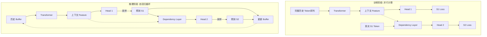

# Kronos 预测模型深度解析

本文档深度剖析 `model/kronos.py` 中 `Kronos` 类（时序预测主模型）的工作原理。该模型采用 **双头依赖解码 (Dual-Head Dependency Decoding)** 机制，是一种专门针对分层 Token 序列设计的自回归 Transformer。

## 一、核心架构概览

`Kronos` 不直接预测股价数值，而是预测下一时刻的 Token ID。由于 Tokenizer 将数据编码为 $S_1$ (Coarse/高位) 和 $S_2$ (Fine/低位) 两组 Token，Predictor 也相应采用了两阶段预测架构。

### 关键组件

1.  **Hierarchical Embedding (分层嵌入)**: 将 $S_1$ 和 $S_2$ Token 映射到同一向量空间并融合。
2.  **Temporal Embedding (时间嵌入)**: 注入时间特征（分钟、小时、星期等）。
3.  **Transformer Backbone**: 标准 Transformer Encoder，提取时序上下文特征。
4.  **Dual Head System (双头系统)**:
    *   **Head 1**: 基于上下文直接预测 $S_1$。
    *   **Dependency Layer**: 引入Cross-Attention，将 $S_1$ 作为条件融合到上下文中。
    *   **Head 2**: 基于增强后的上下文预测 $S_2$。
```
┌─────────────────────────────────────────────────────────────────┐
│                         训练阶段                                 │
│                                                                  │
│  K线数据 → Tokenizer.encode → [s1, s2] tokens (完整序列)        │
│                    ↓                                             │
│         Kronos.forward(s1[:-1], s2[:-1])                        │
│                    ↓                                             │
│         s1_logits, s2_logits (并行输出)                          │
│                    ↓                                             │
│         CrossEntropy(logits, targets[1:])                        │
│                    ↓                                             │
│         loss.backward() → 更新权重                               │
│                                                                  │
│  特点: 并行、Teacher Forcing、Dropout 启用                       │
└─────────────────────────────────────────────────────────────────┘

┌─────────────────────────────────────────────────────────────────┐
│                         推理阶段                                 │
│                                                                  │
│  K线数据 → Tokenizer.encode → [s1, s2] tokens (历史)            │
│                    ↓                                             │
│  ┌─────────── 循环 pred_len 次 ────────────┐                    │
│  │                                          │                    │
│  │  Kronos.decode_s1(buffer) → s1_logits   │                    │
│  │           ↓ 采样                         │                    │
│  │       s1_token                           │                    │
│  │           ↓                              │                    │
│  │  Kronos.decode_s2(context, s1_token)    │                    │
│  │           ↓ 采样                         │                    │
│  │       s2_token                           │                    │
│  │           ↓                              │                    │
│  │    更新滑动窗口 buffer                   │                    │
│  │                                          │                    │
│  └──────────────────────────────────────────┘                    │
│                    ↓                                             │
│  Tokenizer.decode([all_s1, all_s2]) → 预测的 K 线                │
│                                                                  │
│  特点: 串行、自回归采样、Dropout 禁用                            │
└─────────────────────────────────────────────────────────────────┘
```
---

## 二、前向传播工作流与数学原理 (Training Phase)

在训练阶段，模型接收完整的历史序列，并行计算所有时刻的预测结果。

### 1. 符号与维度定义

*   $B$: Batch size
*   $T$: Sequence length (输入序列长度)
*   $D$: Model dimension (`d_model`，例如 256)
*   $V_1, V_2$: $S_1$ 和 $S_2$ 的词表大小 (例如 $2^{10}=1024$)

### 2. 层次化嵌入与融合 (Hierarchical Embedding)

模型首先将两组 Token 转换为向量并融合。

*   **输入**: $I^{(s1)}, I^{(s2)} \in \mathbb{R}^{B \times T}$ (Token IDs)
*   **计算**:
    $$E^{(s1)} = \text{Embedding}_{s1}(I^{(s1)}) \cdot \sqrt{D} \quad \in \mathbb{R}^{B \times T \times D}$$
    $$E^{(s2)} = \text{Embedding}_{s2}(I^{(s2)}) \cdot \sqrt{D} \quad \in \mathbb{R}^{B \times T \times D}$$
    $$X_{cat} = \text{Concat}(E^{(s1)}, E^{(s2)}) \quad \in \mathbb{R}^{B \times T \times 2D}$$
    $$X_{emb} = X_{cat} W_{fusion} + b_{fusion} \quad \in \mathbb{R}^{B \times T \times D}$$
    *其中 $W_{fusion} \in \mathbb{R}^{2D \times D}$*

### 3. 时间特征注入 (Temporal Embedding)

*   **输入**: $Stamp \in \mathbb{R}^{B \times T \times 5}$ (5个时间特征)
*   **计算**:
    $$E_{time} = \sum_{k=1}^{5} \text{Embedding}_{k}(Stamp_{:,:,k})$$
    $$X_{in} = X_{emb} + E_{time} \quad \in \mathbb{R}^{B \times T \times D}$$

### 4. Transformer 主干 (Context Encoding)

提取时序上下文特征。

*   **计算**:
    $$H_{ctx} = \text{TransformerEncoder}(X_{in}) \quad \in \mathbb{R}^{B \times T \times D}$$
    $$H_{ctx} = \text{RMSNorm}(H_{ctx})$$

### 5. 第一级预测 (Head 1: Predict S1)

直接利用上下文预测粗粒度 Token。

*   **计算**:
    $$Logits^{(s1)} = H_{ctx} W_{head1} + b_{head1} \quad \in \mathbb{R}^{B \times T \times V_1}$$
    *其中 $W_{head1} \in \mathbb{R}^{D \times V_1}$*

### 6. 依赖感知层 (Dependency Aware Layer)

这是模型的核心，用于融合 $S_1$ 信息以辅助 $S_2$ 预测。

*   **条件输入**: 在训练时使用 Teacher Forcing（真实的 $S_1$），推理时使用采样得到的 $\hat{S_1}$。
    $$E_{cond} = \text{Embedding}_{s1}(I^{(s1)}_{target}) \quad \in \mathbb{R}^{B \times T \times D}$$
    *(注意：这里实际上是 sibling_embed，即对应的 S1 embedding)*

*   **Cross-Attention**:
    *   **Query ($Q$)**: 来自条件 $S_1$ 信息 ($E_{cond}$)
    *   **Key ($K$), Value ($V$)**: 来自上下文 ($H_{ctx}$)
    *   **目的**: 用 $S_1$ 的特征去查询上下文中相关的信息。
    
    $$Q = E_{cond} W_Q, \quad K = H_{ctx} W_K, \quad V = H_{ctx} W_V$$
    $$Attn = \text{Softmax}\left(\frac{Q K^T}{\sqrt{D/N_{head}}}\right) V$$
    $$H_{dep} = \text{RMSNorm}(H_{ctx} + Attn W_O) \quad \in \mathbb{R}^{B \times T \times D}$$
    
    *(代码实现细节：`DependencyAwareLayer` 接收 `(hidden_states, sibling_embed)`。在 CrossAttention 中，`query=sibling_embed`，`key=value=hidden_states`)*

### 7. 第二级预测 (Head 2: Predict S2)

基于融合了上下文和 S1 信息的特征预测 $S_2$。

*   **计算**:
    $$Logits^{(s2)} = H_{dep} W_{head2} + b_{head2} \quad \in \mathbb{R}^{B \times T \times V_2}$$

---

## 三、推理阶段：自回归循环 (Inference Phase)

推理阶段与训练阶段最大的不同在于**串行生成**。每一步的输入依赖于上一步的输出。

### 数据流与形状变化 (Data Flow)

假设 Batch Size = $B$, Sample Count = $S$, Context Window = $W$。为了并行采样，通常将 Batch 扩展为 $B \times S$。

| 步骤 | 变量 | 形状 | 说明 |
| :--- | :--- | :--- | :--- |
| **0. Buffer** | `input_tokens` | $(B \cdot S, W)$ | 当前滑动窗口内的历史 Token |
| **1. Enocder** | `context` | $(B \cdot S, W, D)$ | Transformer 输出的上下文 |
| **2. Head 1** | `s1_logits` | $(B \cdot S, W, V_1)$ | 每一时刻的预测分布 |
| **3. Slice** | `s1_logits` | $(B \cdot S, V_1)$ | **只取最后一个时间步 ($t=-1$)** |
| **4. Sample** | `sample_pre` | $(B \cdot S, 1)$ | 采样得到当前的 $\hat{s1}$ |
| **5. Embed** | `sibling_embed` | $(B \cdot S, 1, D)$ | 将 $\hat{s1}$ 重新映射为向量 |
| **6. Dep Layer** | `context` | $(B \cdot S, W, D)$ | *注意：这里通常应该只需计算最后一步，但代码可能传入了完整 buffer* |
| **7. CrossAttn** | `x2` | $(B \cdot S, W, D)$ | Key/Val来自上下文, Query来自 S1 |
| **8. Head 2** | `s2_logits` | $(B \cdot S, W, V_2)$ | S2 预测分布 |
| **9. Sample** | `sample_post` | $(B \cdot S, 1)$ | 采样得到当前的 $\hat{s2}$ |
| **10. Update** | `buffer` | $(B \cdot S, W)$ | 将 $\hat{s1}, \hat{s2}$ 滚入 Buffer |

### 自回归循环伪代码

```python
# 初始化 buffer
buffer_s1, buffer_s2 = load_history()

for i in range(pred_len):
    # 1. 编码上下文
    # context: [batch, window, d_model]
    s1_logits_seq, context = model.decode_s1(buffer_s1, buffer_s2)
    
    # 2. 预测 S1 (只取最后一步)
    next_s1_logits = s1_logits_seq[:, -1, :] 
    next_s1 = sample(next_s1_logits)  # [batch, 1]
    
    # 3. 预测 S2 (依赖 S1)
    # 利用刚刚采样得到的 next_s1 作为条件
    s2_logits_seq = model.decode_s2(context, next_s1)
    
    # 4. 预测 S2 (只取最后一步)
    next_s2_logits = s2_logits_seq[:, -1, :]
    next_s2 = sample(next_s2_logits) # [batch, 1]
    
    # 5. 更新滑动窗口
    buffer_s1.append(next_s1)
    buffer_s2.append(next_s2)
```

---

## 四、训练 vs 推理区别总结



| 特性 | 训练阶段 (Train) | 推理阶段 (Inference) |
| :--- | :--- | :--- |
| **S1 来源** | 使用 Ground Truth (真实) $S_1$ | 使用模型刚刚预测并采样的 $\hat{S_1}$ |
| **S2 依赖** | 依赖真实的 $S_1$ | 依赖刚刚预测出的 $\hat{S_1}$ |
| **计算模式** | $t=0 \to T$ 同时计算 | $t$ 时刻计算必须等待 $t-1$ 时刻完成 |
| **DropOut** | 启用 | 禁用 |
