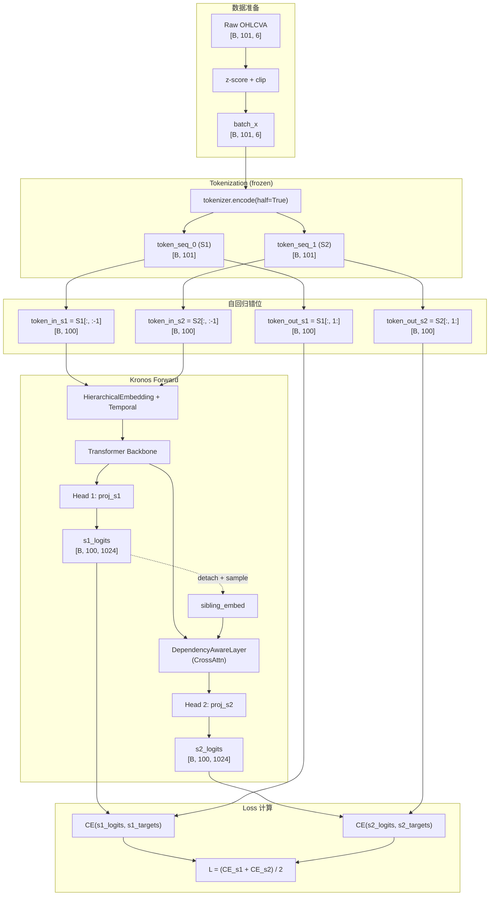

# Kronos 预测模型 Loss 计算详解

本文档完整解析 Kronos 预测模型训练阶段的 Loss 计算流程，从数据准备到最终损失函数的每个环节。

## 一、Loss 计算总览

Kronos 的预测 Loss 是一个**标准的自回归语言模型损失**，核心思想是：给定历史 Token 序列，预测下一个 Token。由于 Kronos 采用分层 Token（$S_1$ 粗粒度 + $S_2$ 细粒度），Loss 被分解为两个 Cross-Entropy 的**均值**。

$$\boxed{\mathcal{L}_{total} = \frac{\mathcal{L}_{CE}^{(s1)} + \mathcal{L}_{CE}^{(s2)}}{2}}$$

> [!IMPORTANT]
> 这里的设计本质上和 GPT 类模型的 next-token prediction 完全一致，只是词表被拆成了两个层级（coarse/fine），对应两个独立的分类头。

---

## 二、数据准备阶段

### 2.1 滑动窗口采样

在 [dataset.py](file:///Users/vacantlot/code/sjtu-lab/Kronos/finetune/dataset.py) 中，每个样本是一个长度为 `lookback_window + predict_window + 1` 的时间窗口。

```
window = lookback_window + predict_window + 1
       = 90 + 10 + 1 = 101  (默认值)
```

**+1 的原因**：自回归模型需要将序列错位一步来构造 (input, target) 对。长度 101 的序列拆成 100 个 input token 和 100 个 target token（后移一位）。

### 2.2 标准化

每个样本独立做 z-score 标准化，然后 clip 到 $[-5, 5]$：

$$\hat{x} = \text{clip}\left(\frac{x - \mu}{\sigma + 10^{-5}}, -5, 5\right)$$

配置项 `normalize_with_context_only` 控制是用整个窗口还是仅用 lookback 部分计算 $\mu, \sigma$。

### 2.3 输出

- `x_tensor`: shape `[window, 6]`，包含 OHLCVA 6 个特征
- `x_stamp_tensor`: shape `[window, 5]`，包含 minute, hour, weekday, day, month

---

## 三、Tokenization 阶段（在线、推理模式）

在 [train_predictor.py L182-183](file:///Users/vacantlot/code/sjtu-lab/Kronos/finetune/train_predictor.py#L182-L183) 中，tokenizer 在 `torch.no_grad()` 下运行：

```python
with torch.no_grad():
    token_seq_0, token_seq_1 = tokenizer.encode(batch_x, half=True)
```

这一步将连续值 `batch_x` (shape `[B, window, 6]`) 转换为两组离散 Token ID：
- `token_seq_0`: $S_1$ IDs，shape `[B, window]`，词表大小 $2^{10} = 1024$
- `token_seq_1`: $S_2$ IDs，shape `[B, window]`，词表大小 $2^{10} = 1024$

Tokenizer 内部流程：`Linear → Encoder Transformer → Linear(d_model → 20) → L2 Norm → BSQ 二值化 → 分割为 s1(10 bit) + s2(10 bit) → 二进制转十进制`。

> [!NOTE]
> Tokenizer 在预测模型训练过程中**完全冻结**（`eval()` 模式 + `no_grad()`），不参与梯度更新。它仅充当一个固定的编码器，将连续数据转为离散 Token 供预测模型学习。

---

## 四、Input-Target 构造（自回归错位）

在 [train_predictor.py L186-187](file:///Users/vacantlot/code/sjtu-lab/Kronos/finetune/train_predictor.py#L186-L187)：

```python
token_in  = [token_seq_0[:, :-1], token_seq_1[:, :-1]]   # 输入：去掉最后一个 token
token_out = [token_seq_0[:, 1:],  token_seq_1[:, 1:]]    # 目标：去掉第一个 token
```

这是标准的 causal language model 训练方式：

```
原始序列:  t_0, t_1, t_2, ..., t_{N-1}, t_N
Input:     t_0, t_1, t_2, ..., t_{N-1}        (去掉末尾)
Target:    t_1, t_2, t_3, ..., t_N             (去掉开头)
```

每个位置 $i$ 的输入是 $t_i$，目标是 $t_{i+1}$。由于 Transformer 内部使用了 causal mask（`is_causal=True`），位置 $i$ 只能看到 $\leq i$ 的 token，所以相当于在每个位置都在做 next-token prediction。

**维度变化**：
- `token_in[0]`, `token_in[1]`: shape `[B, window-1]`，即 `[B, 100]`
- `token_out[0]`, `token_out[1]`: shape `[B, window-1]`，即 `[B, 100]`

---

## 五、前向传播与 Logits 计算

在 [train_predictor.py L190](file:///Users/vacantlot/code/sjtu-lab/Kronos/finetune/train_predictor.py#L190)：

```python
logits = model(token_in[0], token_in[1], batch_x_stamp[:, :-1, :])
```

调用 `Kronos.forward()`，返回 `(s1_logits, s2_logits)`。

### 5.1 S1 Logits

```python
# kronos.py L266
s1_logits = self.head(x)   # Linear: d_model → vocab_s1
```

$$\text{Logits}^{(s1)} = H_{ctx} \cdot W_{s1} + b_{s1} \quad \in \mathbb{R}^{B \times T \times V_1}$$

### 5.2 S2 Logits（依赖 S1）

```python
# kronos.py L268-276
if use_teacher_forcing:
    sibling_embed = self.embedding.emb_s1(s1_targets)   # 使用真实标签
else:
    s1_probs = F.softmax(s1_logits.detach(), dim=-1)
    sample_s1_ids = torch.multinomial(...)               # 采样预测
    sibling_embed = self.embedding.emb_s1(sample_s1_ids)

x2 = self.dep_layer(x, sibling_embed)                   # Cross-Attention 融合
s2_logits = self.head.cond_forward(x2)                   # Linear: d_model → vocab_s2
```

$$\text{Logits}^{(s2)} = H_{dep} \cdot W_{s2} + b_{s2} \quad \in \mathbb{R}^{B \times T \times V_2}$$

> [!TIP]
> **`s1_logits.detach()` 的技巧**：在非 teacher-forcing 模式下，S2 的条件来自 S1 的采样结果，但 `.detach()` 切断了从 S2 loss 回传到 S1 head 的梯度路径。这意味着 S1 head 仅通过 $\mathcal{L}_{CE}^{(s1)}$ 更新，S2 loss 不会干扰 S1 的学习，两个 head 的训练信号相互独立。

---

## 六、Loss 计算核心

### 6.1 `DualHead.compute_loss()`

定义在 [module.py L494-507](file:///Users/vacantlot/code/sjtu-lab/Kronos/model/module.py#L494-L507)：

```python
def compute_loss(self, s1_logits, s2_logits, s1_targets, s2_targets, padding_mask=None):
    if padding_mask is not None:
        valid_mask = (padding_mask == 0)
        s1_logits = s1_logits[valid_mask]
        s2_logits = s2_logits[valid_mask]
        s1_targets = s1_targets[valid_mask]
        s2_targets = s2_targets[valid_mask]
        ce_s1 = F.cross_entropy(s1_logits, s1_targets)
        ce_s2 = F.cross_entropy(s2_logits, s2_targets)
    else:
        ce_s1 = F.cross_entropy(s1_logits.reshape(-1, self.vocab_s1), s1_targets.reshape(-1))
        ce_s2 = F.cross_entropy(s2_logits.reshape(-1, self.vocab_s2), s2_targets.reshape(-1))
    ce_loss = (ce_s1 + ce_s2) / 2
    return ce_loss, ce_s1, ce_s2
```

### 6.2 数学公式

对于无 padding 的情况，logits 和 targets 被 reshape 为 2D：

$$\text{s1\_logits}: [B, T, V_1] \xrightarrow{\text{reshape}} [B \cdot T, V_1]$$
$$\text{s1\_targets}: [B, T] \xrightarrow{\text{reshape}} [B \cdot T]$$

然后计算标准 Cross-Entropy（`F.cross_entropy` 默认使用 `reduction='mean'`，即对所有 $B \cdot T$ 个位置取平均）：

$$\mathcal{L}_{CE}^{(s1)} = -\frac{1}{B \cdot T} \sum_{b=1}^{B} \sum_{t=1}^{T} \log P(s1_{target}^{(b,t)} \mid s1_{logits}^{(b,t)})$$

$$\mathcal{L}_{CE}^{(s2)} = -\frac{1}{B \cdot T} \sum_{b=1}^{B} \sum_{t=1}^{T} \log P(s2_{target}^{(b,t)} \mid s2_{logits}^{(b,t)})$$

其中 $P(c \mid z) = \text{Softmax}(z)_c = \frac{e^{z_c}}{\sum_{j} e^{z_j}}$。

**最终总 Loss**：

$$\boxed{\mathcal{L}_{total} = \frac{1}{2}\left(\mathcal{L}_{CE}^{(s1)} + \mathcal{L}_{CE}^{(s2)}\right)}$$

> [!NOTE]
> S1 和 S2 的 loss 被**等权平均**（权重各 0.5），没有引入可调的加权系数。这是一个设计选择——假设粗粒度和细粒度 token 的预测同等重要。

---

## 七、`compute_token_loss()` 包装层

在 [train_predictor.py L81-98](file:///Users/vacantlot/code/sjtu-lab/Kronos/finetune/train_predictor.py#L81-L98) 中，有一层额外的包装，支持两种 loss 计算模式：

```python
def compute_token_loss(model, logits, token_out, config: dict):
    if not config.get('future_only_loss', False):
        # 模式 1: Full-sequence loss（默认）
        return model.module.head.compute_loss(logits[0], logits[1], token_out[0], token_out[1])

    # 模式 2: Future-only loss
    start_idx = config['lookback_window'] - 1
    end_idx = start_idx + config['predict_window']
    return model.module.head.compute_loss(
        logits[0][:, start_idx:end_idx, :],
        logits[1][:, start_idx:end_idx, :],
        token_out[0][:, start_idx:end_idx],
        token_out[1][:, start_idx:end_idx],
    )
```

### 模式 1: Full-sequence Loss（默认）

对**整个序列**的所有位置计算 next-token prediction loss，包括 lookback 区域内的位置。

### 模式 2: Future-only Loss

仅对**预测窗口**内的位置计算 loss。

切片逻辑：
- `start_idx = lookback_window - 1 = 89`（因为 token_in 已经去掉了第一个位置，所以 target 的第 89 个位置对应原始序列的第 90 个 token，即预测窗口的第一个位置）
- `end_idx = 89 + 10 = 99`

```
原始序列:     t_0, t_1, ..., t_89, t_90, t_91, ..., t_99, t_100
Input:        t_0, t_1, ..., t_89, t_90, t_91, ..., t_99          (100 个)
Target:       t_1, t_2, ..., t_90, t_91, t_92, ..., t_100         (100 个)
                              ↑                            ↑
                           idx=89                       idx=99

Future-only 切片: target[89:99] = [t_90, t_91, ..., t_99]
                  logits[89:99] 对应位置 89~98 的预测
```

> [!TIP]
> Future-only loss 的意义：在金融场景中，我们真正关心的是**未来**的预测精度。对 lookback 区域的 loss 可能使模型过多关注重构历史，而非预测未来。这个选项可通过 `--future-only-loss` 命令行参数或 `KRONOS_FUTURE_ONLY_LOSS=true` 环境变量启用。

---

## 八、完整数据流图



---

## 九、关键设计决策总结

| 设计点 | 选择 | 原因 |
| :--- | :--- | :--- |
| Loss 类型 | Cross-Entropy | 标准分类任务——预测 Token ID |
| S1/S2 权重 | 等权平均 (0.5/0.5) | 简单有效，两个粒度同等重要 |
| Padding 处理 | 布尔 mask 过滤 | 仅在有 padding 时激活，过滤无效位置 |
| S2 依赖 S1 | 采样 + detach | S2 条件化于 S1，但梯度独立 |
| 训练目标范围 | 全序列 / 仅未来 | 可切换，trade-off 在于历史重构 vs 未来预测 |
| Tokenizer | 冻结 | 避免 tokenizer 漂移影响 token 分布稳定性 |
| reduction | mean | 对所有 batch × time 位置取均值 |

---

## 十、代码入口速查

| 环节 | 文件 | 行号 |
| :--- | :--- | :--- |
| 滑动窗口 + 标准化 | [dataset.py](file:///Users/vacantlot/code/sjtu-lab/Kronos/finetune/dataset.py) | L47, L160-172 |
| On-the-fly Tokenization | [train_predictor.py](file:///Users/vacantlot/code/sjtu-lab/Kronos/finetune/train_predictor.py) | L182-183 |
| 自回归错位 (input/target) | [train_predictor.py](file:///Users/vacantlot/code/sjtu-lab/Kronos/finetune/train_predictor.py) | L186-187 |
| Kronos.forward() | [kronos.py](file:///Users/vacantlot/code/sjtu-lab/Kronos/model/kronos.py) | L240-277 |
| DualHead.compute_loss() | [module.py](file:///Users/vacantlot/code/sjtu-lab/Kronos/model/module.py) | L494-507 |
| compute_token_loss() 包装 | [train_predictor.py](file:///Users/vacantlot/code/sjtu-lab/Kronos/finetune/train_predictor.py) | L81-98 |
| future_only_loss 配置 | [config.py](file:///Users/vacantlot/code/sjtu-lab/Kronos/finetune/config.py) | L106 |
