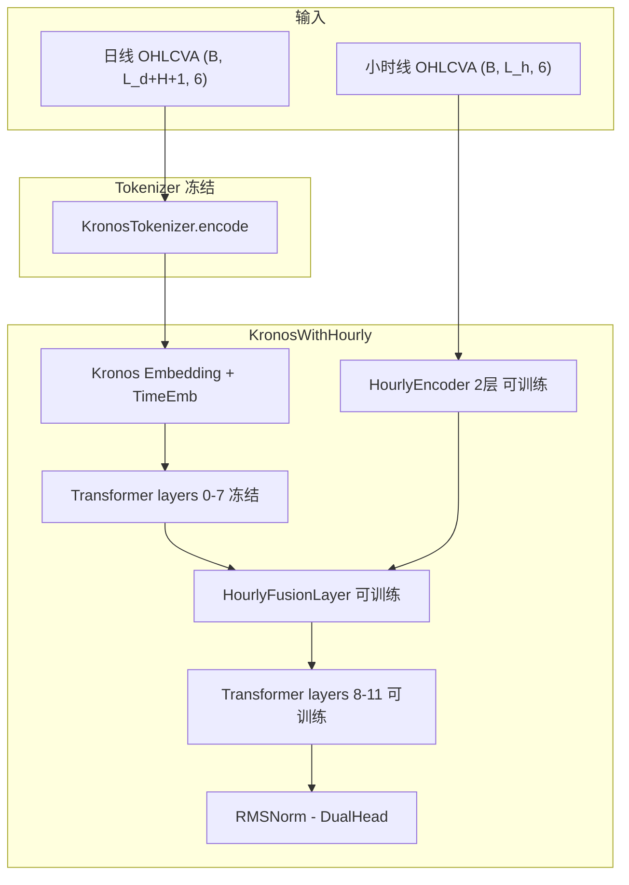

# c 组实现说明

## 目标

C 组在 B 组基础上加入小时线辅流，核心问题是：对日线预测任务，小时线作为更细粒度上下文，是否能带来额外增益。

当前实现遵循三条原则：

* 主任务仍是日线 future-token 预测，和 B 组一致
* 小时线只作为条件输入，不单独加小时线重建目标
* 尽量不侵入 `model/kronos.py` / `model/module.py`，主要通过新增模块完成

## 当前代码结构

当前 C 组链路如下：

* `finetune/csv_data_preprocess_c.py`：构建日线 + 小时线双流数据集
* `finetune/dataset_c.py`：返回 `x_daily / x_stamp_d / x_hourly / x_stamp_h`
* `finetune/models/hourly_encoder.py`：小时线 encoder
* `finetune/models/hourly_fusion.py`：cross-attention fusion
* `finetune/models/kronos_with_hourly.py`：将 Kronos predictor 与小时线分支组装到一起
* `finetune/train_predictor_c.py`：C 组训练脚本
* `finetune/evaluate_c.py`：C 组评估脚本
* `zlab/scripts/prepare_c_data.sh`：C 组数据准备入口
* `zlab/scripts/run_group_c.sh`：C 组训练/评估入口

评估没有复用 `evaluate_ab.py`，而是独立实现了 `evaluate_c.py`。这样做的好处是少动 A/B 已稳定的评估链路；代价是 C 和 A/B 的评估代码后续要同步维护。

## 当前训练口径

当前 C 组训练与 B 组的主协议保持一致：

* tokenizer：冻结
* predictor 前 `2/3`：冻结
* predictor 后 `1/3`：训练
* `norm / dep_layer / head`：训练
* `hourly_encoder / fusion_layer`：训练
* 主损失：`future-only token CE`
* checkpoint 选择：`val loss`

这意味着当前实验口径是：

* B/C 在同样的 `val loss` 选模协议下对比
* 最终报告仍看 `RankIC / IC / DA / MAE / RMSE / top-k / long-short`

因此，当前 C 组还不是“按最优金融指标选模”的正式口径，而是“按 token 验证损失选模，再看下游金融指标”的版本。

## 当前评估口径

`evaluate_c.py` 与 `evaluate_ab.py` 的输出格式保持一致，核心指标相同：

* `mean_rank_ic`
* `mean_ic`
* `rank_ic_ir`
* `direction_accuracy`
* `mae`
* `rmse`
* `topk_mean_return`
* `long_short_topk_mean_return`
* `topk_cum_return`
* `long_short_topk_cum_return`

小时线在评估时只使用历史窗口；对每个样本，小时线 hidden 只编码一次，再复用于自回归解码。

## 2026-04-01 修复

本轮补了三项实现层修复：

### 1. `dataset_c.py` 的环境变量读取修复

原实现错误地用了 `pd.os.environ` 读取 `KRONOS_HOURLY_WINDOW`。当前已改为标准 `os.getenv(...)`。

影响：

* 旧代码在某些环境下会直接报错
* 新代码不会再依赖 `pandas` 的非公开路径行为

### 2. 验证集采样改为确定性

原先 `dataset.py` / `dataset_c.py` 的 `__getitem__` 无论训练还是验证都走随机抽样，这会导致：

* 验证集每次遍历不是固定样本顺序
* 多卡下 `DistributedSampler` 的验证分片语义失真

当前改成：

* `train`：仍然随机抽样
* `val`：按 `idx` 取样

这样验证阶段是稳定、可重复的，和 `DistributedSampler` 配合也更合理。

### 3. `train_predictor_c.py` 的默认配置修复

原实现想通过 `setdefault(...)` 强制 C 组默认值，但 `Config().__dict__` 里这些键本来就存在，所以 `setdefault(...)` 实际不生效。

当前改成：

* 如果对应环境变量已经显式设置，则尊重用户配置
* 如果环境变量未设置，则回落到 C 组默认值

涉及的键包括：

* `future_only_loss`
* `freeze_embedding`
* `train_time_embedding`
* `skip_tokenizer_finetune`
* `predictor_train_last_ratio`

## 与原设计的差异

和最初设计相比，当前实现有三点需要明确：

### 1. 评估脚本是独立实现，不是复用 `evaluate_ab.py`

设计初稿更偏向统一评估入口；当前实现选择了独立的 `evaluate_c.py`。

这不是错误，但会带来两点工程约束：

* C 的评估指标定义要持续对齐 A/B
* A/B 评估脚本变更后，C 组也需要同步检查

### 2. 当前仍按 `val loss` 选模

这和 `zlab/lab.md` 中“正式实验建议按 `validation mean RankIC` 选模”的口径不同。当前先保留原协议，是为了先把 B/C 在同一选模方式下跑通。

### 3. C 组股票池天然可能缩小

C 组数据预处理要求：

* 该股票同时有日线和小时线文件
* 三个 split 都有足够的日线窗口
* 三个 split 都有足够的小时线窗口

因此 C 组股票池不一定与 B 组天然一致。只有当 `metadata.json` 中 `symbols` 完全相同，B/C 的对比才是同一资产池上的对比。

## 现在能回答什么问题

当前实现可以回答的，是这个较弱但仍有价值的问题：

> 在当前 `val loss` 选模协议下，加入小时线条件分支后，C 组的下游金融指标是否优于 B 组？

当前实现还不能单独回答这个更强的问题：

> 小时线本身作为更细粒度信息，是否带来了独立于模型容量增长的额外增益？

原因是 C 组不仅增加了小时线信息，也增加了额外参数容量。

## 后续对比要求

如果要让 B/C 对比更干净，至少应满足下面几条：

* B 和 C 在同一股票池上评估
* B 和 C 使用相同的 `sample_count / top_p / temperature`
* B 和 C 使用相同 horizon 和时间切分
* 最终汇报时明确“当前是按 `val loss` 选模”，不要写成“最优 RankIC 对比”

进一步加强实验识别时，建议加两组消融：

* `C-shuffled-hourly`：保留小时线分支，但打乱小时线内容
* `C-masked-hourly`：保留小时线分支参数量，但不给真实小时线输入

这样才能更好地区分：

* 增益来自小时线信息
* 还是仅仅来自更大的模型容量

## 推荐的下一步

当前最合理的顺序是：

1. 先按当前协议完成 C 组 `H=1/H=5`
2. 核对 B/C `metadata.json` 中的 `symbols` 是否一致
3. 先在当前协议下比较 B/C 的 `RankIC / IC / long-short`
4. 如果 C 有潜在增益，再考虑把选模切到 `val RankIC`
5. 如果要做更强结论，再加 `shuffled/masked hourly` 消融

# C 组实验代码 — 实现总结

## 文件清单

| 文件 | 说明 |
|------|------|
| [hourly_encoder.py](file:///home/yzh/workspace/Kronos-0/finetune/models/hourly_encoder.py) | 2 层 Transformer encoder，将小时 bar 编码为 hidden states |
| [hourly_fusion.py](file:///home/yzh/workspace/Kronos-0/finetune/models/hourly_fusion.py) | Pre-norm cross-attention fusion 层 |
| [kronos_with_hourly.py](file:///home/yzh/workspace/Kronos-0/finetune/models/kronos_with_hourly.py) | 组合模型：Kronos + encoder + fusion，含 AR 推理接口和 save/load |
| [csv_data_preprocess_c.py](file:///home/yzh/workspace/Kronos-0/finetune/csv_data_preprocess_c.py) | 日线+小时线联合预处理，输出双流 pkl |
| [dataset_c.py](file:///home/yzh/workspace/Kronos-0/finetune/dataset_c.py) | 双流 Dataset，返回 `(x_daily, stamp_d, x_hourly, stamp_h)` |
| [train_predictor_c.py](file:///home/yzh/workspace/Kronos-0/finetune/train_predictor_c.py) | C 组训练脚本，分组学习率 + DDP |
| [evaluate_c.py](file:///home/yzh/workspace/Kronos-0/finetune/evaluate_c.py) | C 组评估脚本，输出与 A/B 格式一致 |
| [prepare_c_data.sh](file:///home/yzh/workspace/Kronos-0/zlab/scripts/prepare_c_data.sh) | 数据准备一键脚本 |
| [run_group_c.sh](file:///home/yzh/workspace/Kronos-0/zlab/scripts/run_group_c.sh) | 训练+评估一键脚本 |

## 架构



**Fusion 插入位置**：冻结层 (0-7) 和解冻层 (8-11) 的分界处。这样：
- 冻结层提取日线通用特征
- Fusion 注入小时线条件信息
- 解冻层基于融合信息做任务适配

## 冻结策略与学习率

| 组件 | 可训练 | 学习率 |
|------|:---:|:---:|
| Tokenizer | - | - |
| Kronos embedding | - | - |
| Kronos time_emb | - | - |
| Transformer 0-7 | - | - |
| Transformer 8-11 | Y | 5e-5 与B组一致 |
| norm / dep_layer / head | Y | 5e-5 |
| HourlyEncoder | Y | 1e-4 2x 随机初始化 |
| HourlyFusionLayer | Y | 1e-4 |

## 推理数据流

AR 推理时，hourly context 只 encode 一次，每个生成步复用：

1. `model.encode_hourly(x_hourly, stamp_h)` -> `hourly_hidden`
2. 循环 `pred_len` 步：
   - `model.decode_s1(token_in, stamp_d, hourly_hidden)` -> `s1_logits, context`
   - `model.decode_s2(context, sampled_s1)` -> `s2_logits`
   - 采样 -> 更新 buffer

## 执行步骤

```bash
# 1. 准备 C 组数据 (H=1)
source zlab/ab_env.sh
zlab/scripts/prepare_c_data.sh 1

# 2. 训练 + 评估
zlab/scripts/run_group_c.sh 1

# 3. 对比结果
diff <(jq keys zlab/results/evaluations/h1/group_b/test/metrics.json) \
     <(jq keys zlab/results/evaluations/h1/group_c/test/metrics.json)
```

## 可调参数

通过环境变量或 CLI 覆盖：

| 参数 | 环境变量 | 默认值 |
|------|----------|--------|
| 小时线窗口 | `KRONOS_HOURLY_WINDOW` | 32 |
| 小时线 encoder 层数 | `KRONOS_HOURLY_ENCODER_LAYERS` | 2 |
| 小时线学习率 | `KRONOS_HOURLY_LR` | 1e-4 |
| Epoch 数 | `KRONOS_EPOCHS` | 15 |
| 其余参数 | 与 B 组共用 ab_env.sh | - |

## 检查点保存格式

```text
checkpoints/best_model/
  kronos_predictor/    # 完整 Kronos 权重（含微调后的上层）
  hourly_encoder.pt    # HourlyEncoder state_dict
  hourly_fusion.pt     # HourlyFusionLayer state_dict
  kronos_upper.pt      # 冗余：上层可训练权重的单独存储
  c_config.json        # 架构超参（加载推理时需要）
```
